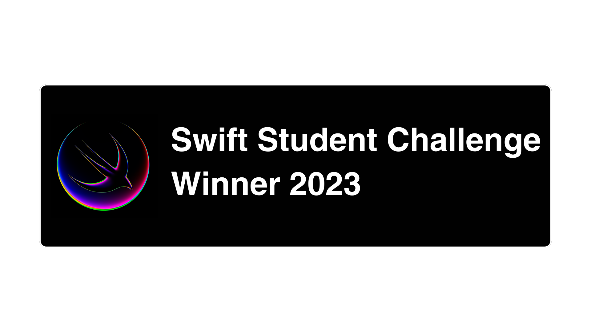

<h1 align="center">A developer in constant learning</h1>

 fascination with technology | passionate about photography | musician in my spare time 

 

  

 
 

  

 

  <kbd>
      
  </kbd>
  &nbsp;&nbsp;&nbsp;&nbsp;&nbsp;&nbsp;
  <kbd>
     
   </kbd>
    &nbsp;&nbsp;&nbsp;&nbsp;&nbsp;&nbsp;
  <kbd>
     
   </kbd>

 

<h3 align="center">Websites and apps developed for study</h3>

 

        <kbd>
        
       </kbd>
       &nbsp;&nbsp;&nbsp;&nbsp;&nbsp;&nbsp;
       <kbd>
       
       </kbd>
       &nbsp;&nbsp;&nbsp;&nbsp;&nbsp;&nbsp;
       <kbd>
       
       </kbd>
       &nbsp;&nbsp;&nbsp;&nbsp;&nbsp;&nbsp;
       <kbd>
       
       </kbd>

 

<!--
  <kbd>
     
     
    &nbsp;&nbsp;&nbsp;
    Websites and apps developed for study
    &nbsp;&nbsp;&nbsp;
     
     
     
    &nbsp;&nbsp;&nbsp;
    <kbd>
      
    </kbd>
    &nbsp;
     <kbd>
      
    </kbd>
    &nbsp;
     <kbd>
      
    </kbd>
    &nbsp;
     
     
    <kbd>
      
    </kbd>
     
     
  </kbd>
    &nbsp;&nbsp;&nbsp;
    -->
    <kbd>
     
    HARD SKILLS
     
     
      &nbsp;&nbsp;&nbsp;
      
      
      
      
      
      
      
      
      &nbsp;&nbsp;&nbsp;
       
       
       
       
       
       
       
       
       
        
        
       
       
    </kbd>
    &nbsp;&nbsp;&nbsp;
    <!--
    <kbd>
     
    SOFT SKILL
     
     
    Communication
     
     
    &nbsp;&nbsp;&nbsp;
    Flexibility and Resilience
    &nbsp;&nbsp;&nbsp;
     
     
    Team work
     
     
    Critical Thinking
     
     
    Conflict management
     
     
    Proactivity
     
     
    Ability to make decisions
     
     
    </kbd>
   
   
  -->

 
 

<h6 align="center">Connect with me:</h6>

                                                                                                                     

<!--

-->

